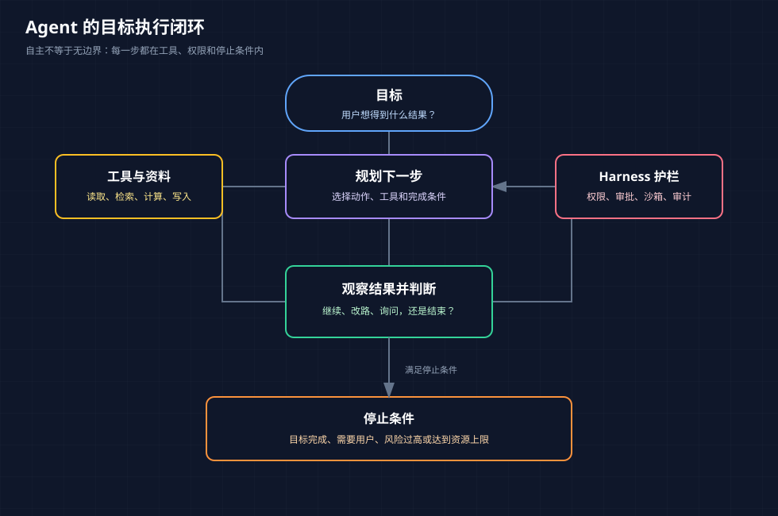

# Agent：围绕目标形成观察与行动闭环

<!-- node_id: agent-loop; source_lines: 836-836; review_required: true -->

## 学习目标

理解 Agent 不只是连续聊天，而是围绕目标规划、调用工具、检查结果并继续推进。

## 核心解释

Agent（智能体）是在模型外组织任务循环的系统。它接收目标，选择下一步，调用工具，观察结果，再决定继续、改路还是结束。所谓“自主”不是没有边界，而是在预设工具、权限和停止条件内减少人工逐步指挥。

## 例子

完成客户复盘时，Agent 可以读取客户资料、整理沟通记录、统计问题、生成报告，并在缺数据时停下来询问。

## 易错点

把一次性调用工具也叫完整 Agent，或认为 Agent 必然能独立完成所有长任务。没有状态、检查和停止规则时，很容易重复、跑偏或误操作。

## 可观察的掌握证据

能把一个目标拆成至少三步，并为每步说明输入、工具结果和停止条件。

## 来源与教学重组说明

- 原材料依据：材料 B 401-438 行；材料 A 97-137 行；材料 D 9-26 行。
- 本单元合并了重复口述、修正了明显转写词形，并增加了连接句和边界提示；这些教学性改写仍需人工审核。
