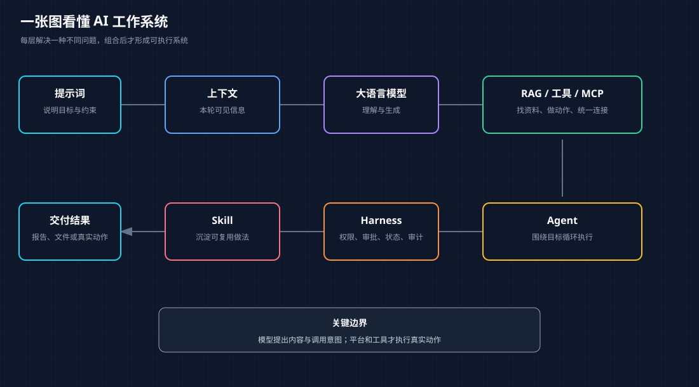

# 先看全景：模型、工具与智能体如何分工

<!-- node_id: ai-system-map; source_lines: 6-6; review_required: true -->

## 学习目标

能用自己的话区分大语言模型、工具和智能体，并知道后续概念在整套系统中的位置。

## 核心解释

把整套 AI 系统想成一个工作团队：大语言模型负责根据上下文生成文字和提出下一步；上下文是它这一次能看到的材料；提示词说明任务；RAG 负责找资料；工具负责执行真实动作；MCP 约定工具如何接入；Agent 负责围绕目标反复规划与执行；Harness 负责权限、审批和失败兜底；Skill 则把一种做事方法沉淀为可复用说明。它们不是十个互相竞争的产品，而是可以组合的层次。

## 例子

当你说“整理本周客户复盘”时，模型理解要求，Agent 拆步骤，RAG 找客户资料，工具读取表格，Harness 要求发送邮件前确认，Skill 规定最终报告结构。

## 易错点

把所有带聊天框的产品都叫 Agent，或把 Agent 当成某一种模型。模型是一种能力核心，Agent 是围绕目标组织模型、工具和状态的系统。

## 可观察的掌握证据

给出一个日常任务，能指出其中谁负责生成、谁负责取资料、谁负责执行、谁负责管控。

## 来源与教学重组说明

- 原材料依据：材料 B 7-23、571-603 行；材料 A 9-18、97-142 行。
- 本单元合并了重复口述、修正了明显转写词形，并增加了连接句和边界提示；这些教学性改写仍需人工审核。
