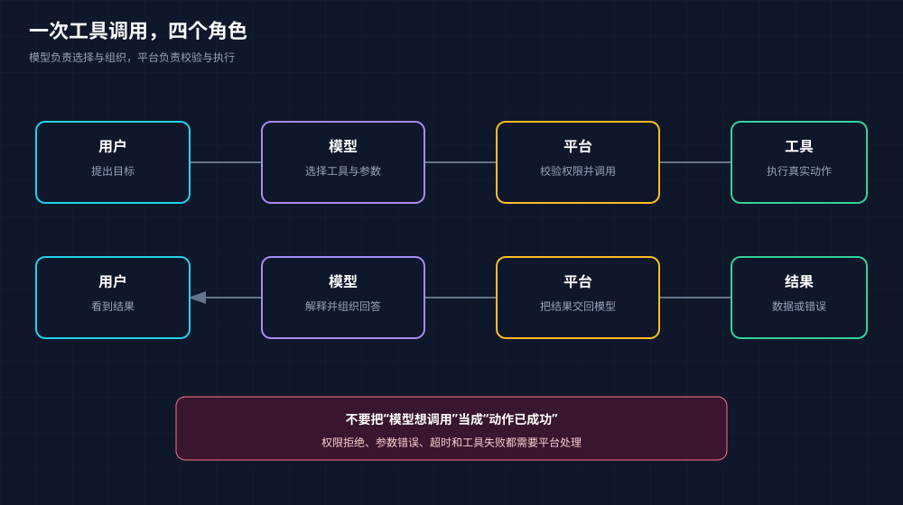

# 工具调用：模型做决定，平台执行动作

<!-- node_id: tool-calling; source_lines: 739-798; review_required: true -->

## 学习目标

分清用户、模型、平台和工具在一次工具调用中的职责。

## 核心解释

工具可以是查询天气、计算、读取表格或发送消息的函数。用户提出目标后，平台把问题和工具说明交给模型；模型选择工具并生成结构化参数；平台校验后真正执行；结果再回到模型，由模型组织成最终回答。模型通常不是直接伸手操作系统，而是提出调用请求。

## 例子

查询天气时，模型输出城市和日期，平台调用天气接口，把返回温度交给模型整理。

## 易错点

把模型的“调用意图”当成已经执行成功。真实系统还要处理权限、参数错误、超时和工具失败。

## 可观察的掌握证据

能把一次工具调用按角色和顺序复述，并指出哪一步真正接触外部系统。

## 来源与教学重组说明

- 原材料依据：材料 B 305-364 行；材料 A 27-53 行。
- 本单元合并了重复口述、修正了明显转写词形，并增加了连接句和边界提示；这些教学性改写仍需人工审核。
