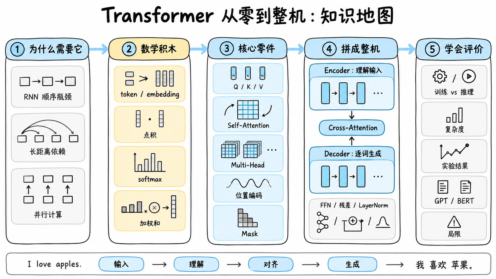
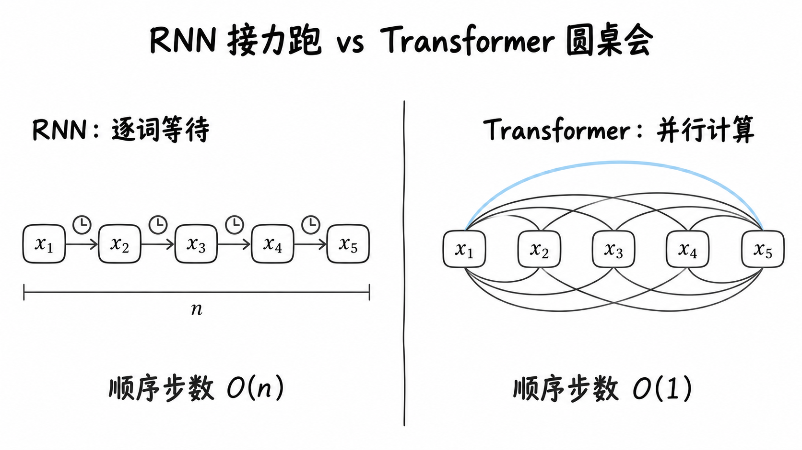
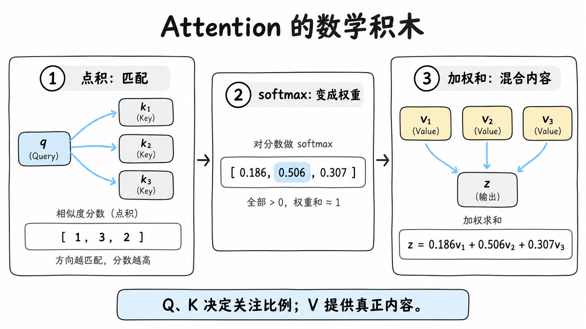
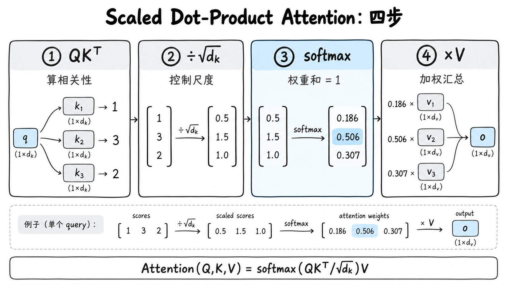
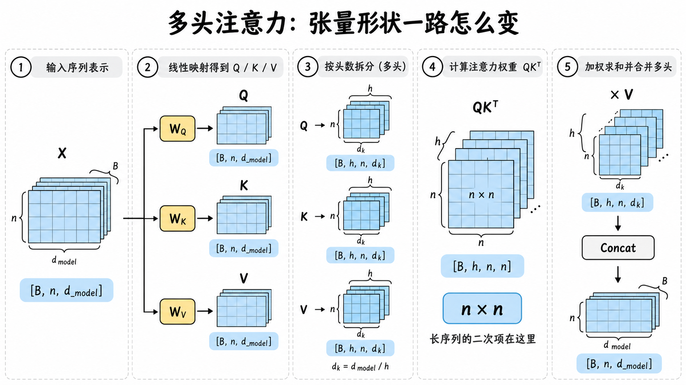
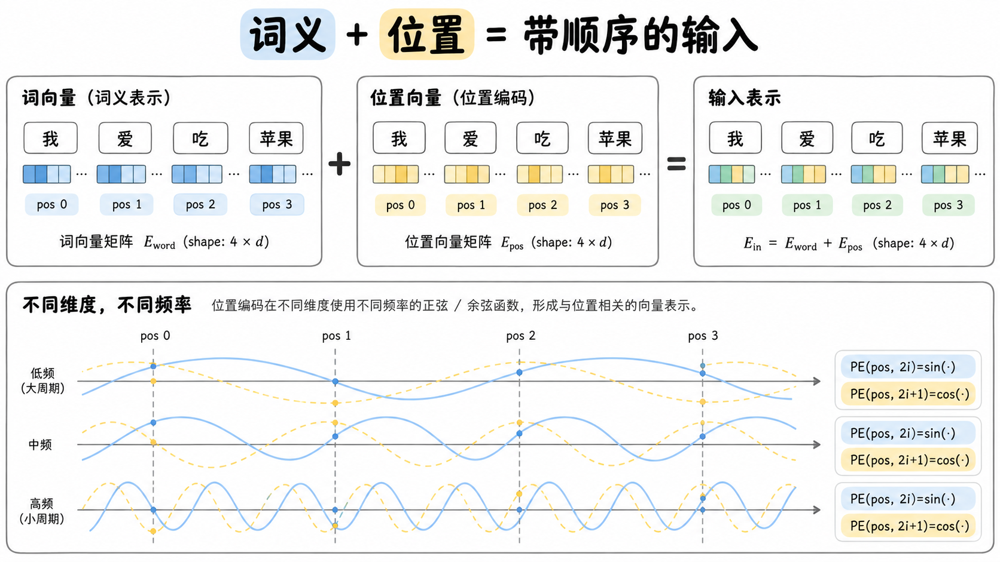
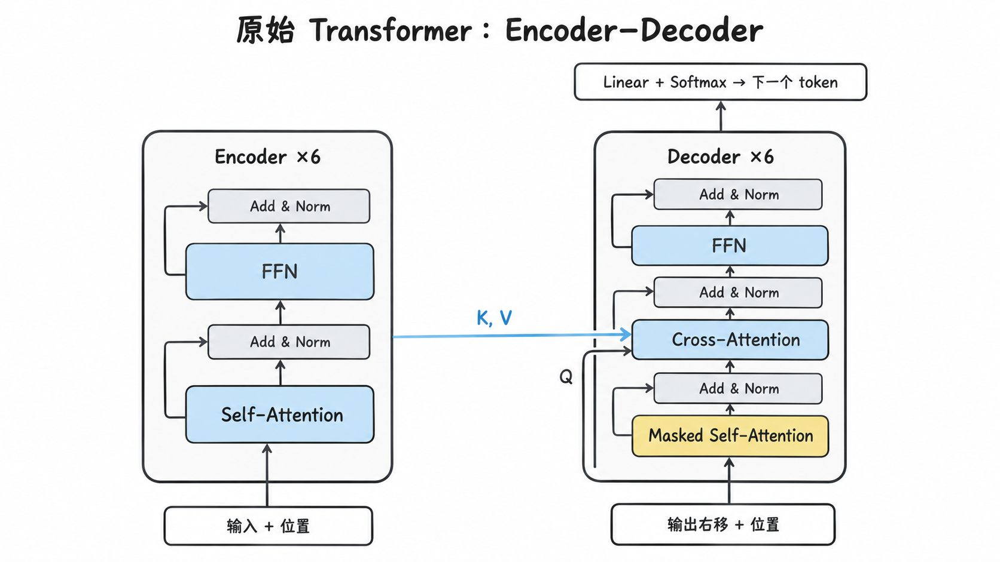
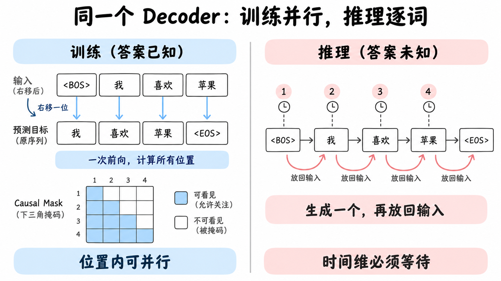
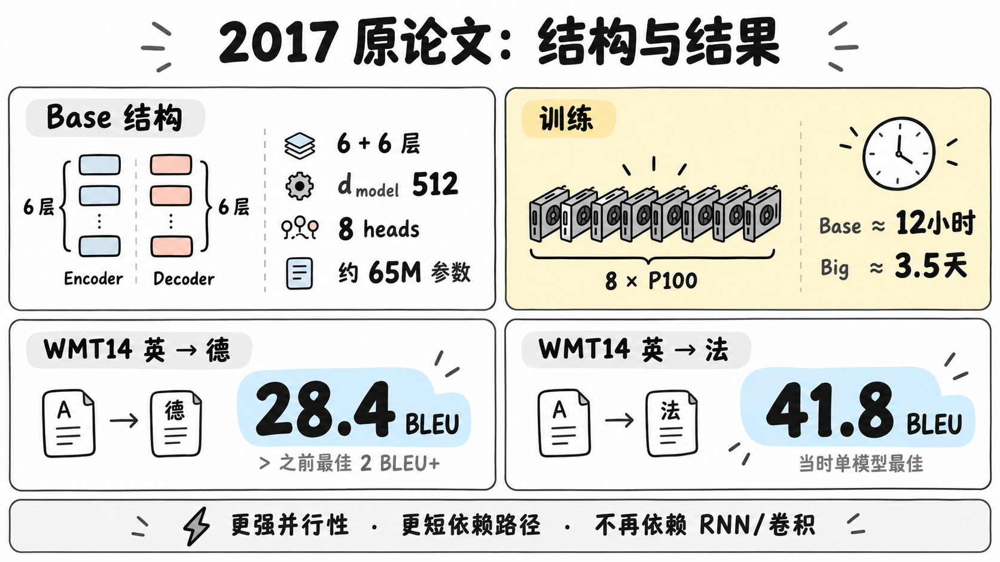

# 真正从零读懂《Attention Is All You Need》

## 从“一个词如何看见另一个词”，一直讲到完整 Transformer、训练过程与现代大模型

> 这不是一篇只告诉你“Q、K、V 分别是什么”的速读文章。目标是：读完以后，你能沿着数据流解释原始 Transformer 的每个主要部件，能看懂核心公式中的每一项，能说清训练和生成为什么不同，也能分辨 2017 年原论文与今天 GPT、BERT 等模型的关系。

---

## 阅读地图：我们会走过四层台阶

很多 Transformer 讲解难懂，不是因为公式本身太难，而是因为一上来就展示论文架构图。那张图同时包含十几个概念，初学者只能记名词，无法建立因果关系。

这篇文章换一个顺序：

1. **问题层**：旧方法哪里慢，为什么需要 Attention？
2. **数学层**：向量、点积、softmax、加权和究竟在做什么？
3. **零件层**：Q/K/V、Self-Attention、多头、位置编码分别解决什么问题？
4. **整机层**：Encoder、Decoder、Mask、训练、推理如何拼成翻译系统？

如果你完全是小白，按顺序阅读。已经熟悉线性代数的人，可以跳过第二章的数学预备。



### 贯穿全文的主线案例

为了避免每一章都换一个例子，后文会反复回到同一项翻译任务：

```text
源句：I love apples.
目标：我 喜欢 苹果。
```

我们会跟着它走完以下路径：

```text
token → embedding → 位置编码
      → Encoder Self-Attention → Encoder 表示
      → Decoder Masked Self-Attention
      → Cross-Attention → 词表概率 → 逐词输出
```

长句中的代词指代仍会作为“为什么需要长距离关系”的补充例子，但所有核心零件都尽量装回这条主线。

---

# 第一部分：Transformer 为什么会出现？

## 1. 论文最初解决的不是聊天，而是机器翻译

《Attention Is All You Need》发表于 2017 年。论文的核心任务是把一个语言序列转换成另一个语言序列，例如：

```text
输入：I love apples.
输出：我 喜欢 苹果。
```

这类任务叫作 **sequence transduction**，可以理解为“序列到序列的变换”。输入和输出长度可以不同，每个输出词又常常依赖输入中的多个位置。

例如：

> The animal didn't cross the street because **it** was too tired.

翻译 `it` 时，模型必须结合 `animal` 和 `tired`，判断代词指向动物而不是街道。这要求模型建立跨越多个词的关系。

## 2. 在 Transformer 之前：RNN 像一场接力跑

RNN 处理句子时，会不断更新一个隐藏状态：

\[
h_t=f(x_t,h_{t-1})
\]

第 \(t\) 步的结果依赖第 \(t-1\) 步，因此一句话必须大致按顺序计算。

这带来两个问题。

### 2.1 计算难以并行

GPU 擅长一次处理大量矩阵运算，却不擅长等待。RNN 的第 10 步必须等第 9 步完成；一句话越长，串行链越长。

### 2.2 长距离信息要经过很多中间站

句首的信号若要影响句尾，需要穿过许多隐藏状态。LSTM、GRU 使用门控机制缓解了遗忘和梯度问题，但没有消除逐步计算本身。



## 3. Attention 在 Transformer 之前已经存在

Transformer 并不是注意力机制的发明者。早期神经机器翻译常使用 RNN Encoder–Decoder：Encoder 把输入压缩成表示，Decoder 逐词生成。Bahdanau Attention 等工作让 Decoder 在每一步都能回看 Encoder 的不同位置，从而缓解“整个句子只能塞进一个固定向量”的瓶颈。

但当时的 Attention 通常是 **RNN 的辅助部件**。2017 年论文真正激进的地方是：

> 如果 Attention 已经可以直接在任意位置之间搬运信息，能不能把循环层和卷积层都拿掉？

Transformer 的答案是可以。论文用 Self-Attention 作为序列内部主要的信息交换机制。

## 4. 一句话概括 Transformer 的革命

RNN 的信息路径是：

```text
词 1 → 词 2 → 词 3 → …… → 词 n
```

Self-Attention 的信息路径是：

```text
任意词 ↔ 任意词
```

前者像接力跑，后者像所有人同时参加圆桌会。Transformer 的优势不只是“能看得远”，还在于这些关系可以整理成大规模矩阵乘法，适合 GPU 并行执行。

> **装回整机 ①**：这一部分只解决“为什么要换掉 RNN”。此时机器还没组装；下一步先把文本变成向量，再学习向量之间如何计算关系。

---

# 第二部分：读公式前，只需要补五个数学概念

## 5. Token：模型处理的基本单位

模型不会直接读取“句子”。文本先经过 tokenizer，被切成 token。token 可能是一个字、一个词、一个词的一部分，或标点符号。

原论文在英德翻译中使用 byte-pair encoding 一类子词方法，源语言与目标语言共享约 37,000 个 token 的词表；英法任务使用约 32,000 个 word-piece 词表。

初学时可以把 token 暂时理解成“词”，但要知道真实模型经常按子词切分。

在主线案例中，可以先把源句简化成：

```text
[I] [love] [apples] [.]
```

真实 tokenizer 可能采用不同切分，但进入 Transformer 的始终是一串 token 编号。

## 6. Embedding：把离散符号变成连续向量

词表中的 token 最初只是编号。例如：

```text
I → 125
love → 932
apples → 4810
```

编号之间没有自然的语义距离。Embedding 层通过一张可学习的表，把每个 token 映射为向量：

\[
x_{\text{apples}}=[0.21,-0.73,0.08,\dots]
\]

原论文基础模型的向量维度是 \(d_{model}=512\)。向量不是人工解释的属性清单，而是训练中逐渐形成的分布式表示。

## 7. 点积：衡量两个方向有多匹配

两个向量的点积是对应元素相乘后相加：

\[
q\cdot k=\sum_i q_i k_i
\]

例子：

\[
[1,2]\cdot[3,4]=1\times3+2\times4=11
\]

在 Attention 中，点积被用作 Query 与 Key 的匹配分数。点积越大，通常表示二者在当前学到的表示空间中越匹配。

它不是人类语义相似度的固定规则。什么算“匹配”，取决于训练得到的投影矩阵。

## 8. Softmax：把任意分数变成一组权重

若原始分数为 \([s_1,s_2,s_3]\)，softmax 定义为：

\[
\operatorname{softmax}(s_i)=\frac{e^{s_i}}{\sum_j e^{s_j}}
\]

结果具有三个性质：

- 每个值都大于 0；
- 所有值加起来等于 1；
- 较大的分数会获得更大的权重。

因此 softmax 可以把“匹配分数”转换成“每个来源应该贡献多少”。

## 9. 加权和：不是选一个，而是按比例混合

若三个权重为 \([0.2,0.5,0.3]\)，三个 Value 为 \(v_1,v_2,v_3\)，输出就是：

\[
z=0.2v_1+0.5v_2+0.3v_3
\]

这非常重要：Attention 通常不是从多个词中硬选一个，而是生成一份按比例混合的信息。

## 10. 线性投影：同一份输入可以有不同用途

给定输入向量 \(x\)，乘以不同的可学习矩阵，会得到不同表示：

\[
q=xW^Q,\qquad k=xW^K,\qquad v=xW^V
\]

同一个词因此可以同时拥有三种角色。你可以把它类比成同一个人在会议中填写三张卡片：

- 我想问什么？
- 我能被怎样找到？
- 真正需要传递的内容是什么？

到这里，已经具备理解核心公式的全部数学基础。



> **装回整机 ②**：token 和 embedding 准备了“原材料”；点积、softmax、加权和准备了“信息混合器”；三组线性投影则让同一份输入能分别充当 Q、K、V。

---

# 第三部分：把 Self-Attention 从头算一遍

## 11. Q、K、V 到底各自负责什么？

最稳定的理解方式不是把 Q/K/V 翻译成“查询、键、值”后死记，而是看它们在流程中的职责：

| 名称 | 作用 | 它参与哪一步？ |
|---|---|---|
| Query | 表达当前位置正在寻找什么 | 与所有 Key 算匹配分数 |
| Key | 表达每个位置可被怎样匹配 | 被 Query 检索 |
| Value | 表达该位置真正提供的内容 | 按权重被加权汇总 |

一个常见误区是把 Key 当成数据库主键。这里的 Key 不是唯一编号，而是一个连续向量；多个 Key 都可以与同一个 Query 有不同程度的匹配。

## 12. 单个 Query 的四步计算

核心公式为：

\[
\operatorname{Attention}(Q,K,V)
=\operatorname{softmax}\left(\frac{QK^T}{\sqrt{d_k}}\right)V
\]

把它从内向外读：

1. \(QK^T\)：每个 Query 和每个 Key 做点积。
2. 除以 \(\sqrt{d_k}\)：控制分数尺度。
3. softmax：把每行分数变成概率式权重。
4. 乘以 \(V\)：对 Value 加权求和。



## 13. 一组完整的玩具算例

句子是：

```text
I / love / apples
```

我们只更新 `love` 这个位置。假设它的 Query 与三个 Key 点积后得到：

\[
[1,3,2]
\]

为了让数字简单，设 \(d_k=4\)，所以 \(\sqrt{d_k}=2\)。缩放后：

\[
[0.5,1.5,1.0]
\]

softmax 后约为：

\[
[0.186,0.506,0.307]
\]

由于四舍五入，三项相加约为 0.999。现在再假设三个 Value 是二维向量：

\[
V_{\text{I}}=[1,0],\quad
V_{\text{love}}=[0,1],\quad
V_{\text{apples}}=[1,1]
\]

输出为：

\[
\begin{aligned}
z_{\text{love}}
&=0.186[1,0]+0.506[0,1]+0.307[1,1]\\
&=[0.493,0.813]
\end{aligned}
\]

这表示 `love` 的新表示中混入了三个位置的内容，而且混合比例由上下文相关性决定。它不再只是孤立的词向量，而开始携带“谁在喜欢、喜欢什么”的上下文线索。

这个例子只为展示算术。真实模型中的向量有几十或几百维，数值全部由训练学习，不会直接对应人类能命名的特征。

## 14. 为什么要除以 \(\sqrt{d_k}\)？

设 Q 和 K 各维独立、均值为 0、方差为 1。它们的点积是 \(d_k\) 项随机乘积之和，其方差会随 \(d_k\) 增长，标准差约随 \(\sqrt{d_k}\) 增长。

维度越高，点积绝对值越容易变大。大数进入 softmax 后会让分布过于尖锐，例如几乎变成：

\[
[0.0001,0.9998,0.0001]
\]

softmax 进入饱和区后，梯度很小，训练会更困难。除以 \(\sqrt{d_k}\) 相当于把分数拉回较稳定的尺度。

在原始基础模型中，每头 \(d_k=64\)，所以缩放因子是 \(\sqrt{64}=8\)。

## 15. Self-Attention 的“Self”是什么意思？

如果 Q、K、V 都来自同一段序列，就是 Self-Attention：这段序列在观察自己。

以输入矩阵 \(X\) 表示整句话：

\[
Q=XW^Q,\quad K=XW^K,\quad V=XW^V
\]

Encoder Self-Attention 中，每个输入位置都能关注全部输入位置。Decoder 的 Masked Self-Attention 也来自同一输出序列，但未来位置会被遮住。

如果 Q 来自 Decoder，而 K、V 来自 Encoder，就不是 Self-Attention，而是 **Cross-Attention（交叉注意力）**。

## 16. 从一个词推广到整句话：矩阵形式

假设序列长度为 \(n\)，每头维度为 \(d_k\)：

\[
Q\in\mathbb{R}^{n\times d_k},\quad
K\in\mathbb{R}^{n\times d_k},\quad
V\in\mathbb{R}^{n\times d_v}
\]

那么：

\[
QK^T\in\mathbb{R}^{n\times n}
\]

这个 \(n\times n\) 矩阵可以看成一张关系表：

- 第 \(i\) 行：第 \(i\) 个位置在看谁；
- 第 \(j\) 列：第 \(j\) 个位置被关注多少；
- 元素 \((i,j)\)：位置 \(i\) 的 Query 与位置 \(j\) 的 Key 的匹配分数。

softmax 通常沿每一行进行，使每个 Query 对所有 Key 的权重和为 1。最后乘 \(V\)，得到：

\[
Z\in\mathbb{R}^{n\times d_v}
\]

因此输入有多少个位置，输出仍有多少个位置；每个位置只是获得了新的上下文表示。

## 17. 带 batch 和多头时，形状如何变化？

设：

- batch size：\(B\)
- 序列长度：\(n\)
- 模型维度：\(d_{model}\)
- 头数：\(h\)
- 每头维度：\(d_k=d_{model}/h\)

常见形状是：

| 张量 | 形状 |
|---|---|
| 输入 \(X\) | \([B,n,d_{model}]\) |
| 切分后的 Q/K/V | \([B,h,n,d_k]\) |
| 注意力分数 \(QK^T\) | \([B,h,n,n]\) |
| 每头输出 | \([B,h,n,d_k]\) |
| 拼接后 | \([B,n,h\cdot d_k]\) |
| 输出投影后 | \([B,n,d_{model}]\) |

这张表也解释了长序列为何昂贵：中间分数张量含有 \(B\times h\times n\times n\) 个元素。



## 18. Mask 实际加在哪里？

Mask 通常在 softmax 前加入分数矩阵：

\[
S=\frac{QK^T}{\sqrt{d_k}}+M
\]

允许关注的位置，\(M=0\)；禁止关注的位置，\(M=-\infty\)。于是：

\[
\operatorname{softmax}(-\infty)=0
\]

常见 Mask 有两种：

- **Padding Mask**：不让模型关注补齐长度用的空 token。
- **Causal / Look-ahead Mask**：不让 Decoder 看到未来 token。

前者主要处理不同长度的批次，后者保证自回归生成不作弊。

> **装回整机 ③**：现在已经造出单头 Self-Attention。它接收整句矩阵，生成同样长度的新表示；每个位置都按照自己的 Query，从全句 Key/Value 中取回信息。

---

# 第四部分：为什么需要 Multi-Head Attention？

## 19. 一个头可能不够表达多种关系

一句话里同时存在很多关系：相邻搭配、主谓结构、代词指代、长距离依赖等。如果只在一个表示空间里计算一次注意力，多种关系可能互相挤压。

Multi-Head Attention 给每个头一套独立投影：

\[
\operatorname{head}_i=
\operatorname{Attention}(QW_i^Q,KW_i^K,VW_i^V)
\]

再把各头结果拼接并投影：

\[
\operatorname{MultiHead}(Q,K,V)
=\operatorname{Concat}(head_1,\dots,head_h)W^O
\]


## 20. “多个头”不是把模型维度乘八倍

原始基础模型：

\[
d_{model}=512,\qquad h=8,\qquad d_k=d_v=64
\]

每个头处理 64 维，8 个头拼接后正好回到 512 维：

\[
8\times64=512
\]

因此多头的主要价值是不同投影空间，而不是简单把最终通道数扩大 8 倍。

## 21. 不要把每个头过度人格化

论文展示了一些可视化：部分头会关注长距离依赖、指代关系或句法结构。这说明模型能够学到有意义的模式。

但不能由此推断“第 3 头永远负责主语，第 5 头永远负责代词”。不同训练、不同层、不同样本中的行为会变化；某些头也可能冗余。注意力图是观察窗口，不是完整的因果解释。

在主线案例中，一个头可能更关注 `I ↔ love`，另一个头可能更关注 `love ↔ apples`。这只是帮助理解的可能模式，不是预先写死的规则。

> **装回整机 ④**：把多个单头并排运行、拼接，再投影回 \(d_{model}\)，就得到 Transformer 中实际使用的 Multi-Head Attention。

---

# 第五部分：没有循环，模型怎么知道顺序？

## 22. Self-Attention 天生像在处理集合

假设同时打乱输入 token 及其 Q/K/V 的行，注意力会跟着打乱，却不会凭空知道原来的先后顺序。

因此，仅有 Self-Attention 的模型会更像看到“一袋词”。语言中的“我打你”和“你打我”显然不同，必须显式注入位置信息。

## 23. 原论文的正弦/余弦位置编码

论文将位置编码与词 embedding 直接相加：

\[
H^{(0)}=Embedding(tokens)\sqrt{d_{model}}+PE
\]

位置编码公式为：

\[
PE_{(pos,2i)}=\sin\left(pos/10000^{2i/d_{model}}\right)
\]

\[
PE_{(pos,2i+1)}=\cos\left(pos/10000^{2i/d_{model}}\right)
\]

偶数维使用正弦，奇数维使用余弦；不同维度的波长不同。



## 24. 为什么用很多种频率？

可以把每个位置想成同时读取许多只转速不同的钟：

- 高频维度变化快，能细致区分相邻位置；
- 低频维度变化慢，能表达更大尺度的位置变化；
- 多种频率组合后，每个位置得到独特的高维坐标。

正弦函数还使固定相对偏移可以由线性关系表达，这是作者选择它的重要动机之一。

论文也测试了可学习的位置 embedding，结果几乎相同。作者最终采用正弦/余弦版本，是因为它可能更容易外推到训练长度之外；这是一种动机和实验观察，不应夸大为“任意长度都能可靠泛化”。

在主线案例中，`I`、`love`、`apples` 即使使用相同维度的词向量，也会分别叠加位置 0、1、2 的编码。这样模型既知道“是什么词”，也知道“出现在什么位置”。

> **装回整机 ⑤**：词 embedding 与位置编码相加后，才成为最底层 Encoder 和 Decoder 真正接收的输入。

---

# 第六部分：Encoder 不是只有 Attention

## 25. 先看整台原始 Transformer

原论文采用 Encoder–Decoder 架构，基础模型两边各堆叠 6 层。



Encoder 把输入加工成上下文表示；Decoder 根据已经生成的目标 token，同时读取 Encoder 结果，预测下一个 token。

## 26. 一个 Encoder 层有两个核心子层

每层包含：

1. Multi-Head Self-Attention
2. Position-wise Feed-Forward Network

此外，每个子层外都有残差连接和 LayerNorm。


## 27. FFN：每个位置独立使用同一台“小计算器”

公式为：

\[
FFN(x)=\max(0,xW_1+b_1)W_2+b_2
\]

基础模型中维度变化是：

\[
512\rightarrow2048\rightarrow512
\]

注意力层负责位置之间的信息交换；FFN 不再跨位置混合，而是对每个位置独立应用相同参数。

“相同参数”是指同一层内所有位置共享一套 FFN。不同 Encoder 层之间通常拥有不同参数，6 层不是同一个模块反复循环使用同一权重。

## 28. 残差连接为什么重要？

若子层函数为 \(F(x)\)，残差连接输出：

\[
x+F(x)
\]

它提供一条信息直通路径。即使新子层一开始学得不好，原输入仍能继续向上传递；反向传播时梯度也有更直接的通路。

## 29. LayerNorm 在规范什么？

LayerNorm 对单个 token 表示内部的特征维进行归一化。它不同于依赖批次统计量的 BatchNorm，因此更适合变长序列和自回归模型。

原论文的子层结构是：

\[
LayerNorm(x+Sublayer(x))
\]

也就是先经过子层，做残差相加，再归一化，通常叫 **Post-Norm**。许多后续大模型使用 Pre-Norm：

\[
x+Sublayer(LayerNorm(x))
\]

后者常让深层网络更容易优化，但它不是 2017 年原论文配置。

## 30. 为什么堆叠多层？

第一层直接在 token embedding 上交换信息；更高层处理的已经是“融合过上下文的表示”。

因此第二层不是再次只比较原始词，而是在比较第一层形成的上下文特征。多层堆叠让模型能反复进行：

```text
收集关系 → 独立加工 → 再收集更高层关系 → 再加工
```

这比“每层只看得更远”更准确，因为单层 Self-Attention 本来就能连接任意两个位置；深度主要增加表示变换的层次和组合能力。

在主线案例中，6 层 Encoder 最终输出的已不再是三个孤立词义，而是三份带上下文的源句表示。可以把它们看作 Decoder 之后反复查询的“源句记忆库”。

> **装回整机 ⑥**：Encoder 层 = 多头自注意力 + FFN，并在每个子层外使用残差和 LayerNorm；重复 6 层后形成 Encoder memory。

---

# 第七部分：Decoder 的三种信息来源

## 31. Decoder 每层为什么有三个子层？

一个 Decoder 层包含：

1. **Masked Self-Attention**：读取已经出现的目标 token。
2. **Cross-Attention**：读取 Encoder 的源句表示。
3. **FFN**：逐位置加工。

三者分别回答：

- 我已经生成了什么？
- 原文里哪些位置与当前生成最相关？
- 如何进一步变换当前表示？

## 32. Causal Mask：训练时也不能偷看答案

训练时，完整目标句已经在数据中。例如目标为：

```text
<BOS> 我 喜欢 苹果 <EOS>
```

Decoder 输入会右移：

```text
输入：<BOS> 我 喜欢 苹果
目标：我    喜欢 苹果 <EOS>
```

预测“喜欢”时，只能看到 `<BOS> 我`，不能看到后面的“苹果”。因果 Mask 让第 \(i\) 个位置只关注不晚于 \(i\) 的位置。

## 33. Cross-Attention 中 Q、K、V 来自哪里？

这是理解 Encoder–Decoder 的关键：

- Q：来自 Decoder 当前层；
- K：来自 Encoder 最终输出；
- V：来自 Encoder 最终输出。

Decoder 用当前生成需求去查询源句。这和搜索系统的直觉非常接近：Decoder 提出问题，Encoder 提供索引与内容。


### 三种 Attention 放在一起比较

| 类型 | Query 来自哪里？ | Key / Value 来自哪里？ | 能看哪些位置？ | 主要作用 |
|---|---|---|---|---|
| Encoder Self-Attention | 当前 Encoder 层输入 | 同一份 Encoder 层输入 | 全部有效源位置 | 让源句内部交换上下文 |
| Decoder Masked Self-Attention | 当前 Decoder 层输入 | 同一份 Decoder 层输入 | 当前位置及过去位置 | 汇总已生成的目标上下文，同时禁止偷看未来 |
| Encoder–Decoder Cross-Attention | Decoder 中间表示 | Encoder 最终输出 | 全部有效源位置 | 根据当前生成需求，从源句中取信息 |

最容易混淆的是 Cross-Attention：它的 Q 与 K/V 不来自同一序列，所以不叫 Self-Attention。

## 34. 最后的 Linear + Softmax 如何变成词？

Decoder 顶层输出仍是 \(d_{model}\) 维向量。一个线性层把它映射到词表大小：

\[
logits=hW+b
\]

若目标词表有 32,000 个 token，logits 就有 32,000 个分数。softmax 把它们变成概率分布，再由贪心选择、采样或 beam search 等策略选出 token。

原论文在 embedding 和 softmax 前的线性变换之间共享权重矩阵，以减少参数并利用输入输出表示之间的联系。

在主线案例中，Decoder 从 `<BOS>` 开始预测“我”；生成“我”后再预测“喜欢”；同时每一步通过 Cross-Attention 读取 `I / love / apples` 的 Encoder 表示。

> **装回整机 ⑦**：Decoder 层 = 带因果遮罩的目标端 Self-Attention + 读取源句的 Cross-Attention + FFN。三者的 Q/K/V 来源不同，正是上表要牢牢记住的结构。

---

# 第八部分：训练和推理不是一回事

## 35. 为什么训练可以并行？

训练时，正确目标句全部已知。通过“右移目标 + 因果 Mask”，可以在一次前向计算中同时预测所有位置：

```text
位置 1：根据 <BOS> 预测“我”
位置 2：根据 <BOS> 我 预测“喜欢”
位置 3：根据 <BOS> 我 喜欢 预测“苹果”
位置 4：根据……预测 <EOS>
```

这些位置虽然拥有不同可见范围，但可以装进同一张下三角 Mask 的矩阵运算中。这是训练并行性的关键之一。

## 36. 为什么推理仍然逐词？

推理时没有正确答案。模型必须先生成“我”，才能把“我”加入上下文并生成“喜欢”。因此自回归 Decoder 的时间维仍然是：

```text
生成 1 → 放回输入 → 生成 2 → 放回输入 → ……
```

所以“Transformer 完全没有顺序计算”是错误的。更准确的说法是：

- Encoder 内部和训练时各已知位置能高度并行；
- 自回归生成仍按 token 顺序进行。



## 37. Teacher Forcing 带来的训练—推理差异

训练时模型看到的历史通常是真实 token；推理时看到的是自己之前生成的 token。如果早期生成错了，错误可能继续影响后续，这种差异常被称为 exposure bias。

它不是 Transformer 独有的问题，而是许多自回归序列模型共同面对的问题。

## 38. 一次完整翻译的数据流

现在把所有零件串起来：

1. 源句切成 token。
2. token 查 embedding，并加位置编码。
3. 输入通过 6 层 Encoder。
4. 得到 Encoder memory：每个源位置的上下文表示。
5. 目标序列右移后进入 Decoder。
6. Masked Self-Attention 汇总已知目标上下文。
7. Cross-Attention 用 Decoder Query 检索 Encoder Key/Value。
8. FFN 对每个位置继续加工。
9. 重复 6 层 Decoder。
10. Linear + softmax 产生词表概率。
11. 训练时对所有目标位置计算损失；推理时选出一个 token 并循环。

可以压缩成一句心智口诀：

> Embedding 负责“变成向量”，位置编码负责“标明顺序”，Self-Attention 负责“交换上下文”，FFN 负责“各自加工”，Cross-Attention 负责“从原文取信息”，Mask 负责“禁止偷看未来”。

### 主线案例终于闭环

```text
I / love / apples
  → Encoder：得到三份上下文化源句表示
  → Decoder 输入 <BOS>
  → 预测“我”并放回输入
  → 预测“喜欢”并放回输入
  → 预测“苹果”并放回输入
  → 预测 <EOS>，生成结束
```

> **装回整机 ⑧**：至此，读者已经从输入 token 走到输出 token。后面的训练配方、复杂度和实验结果，是解释这台机器如何被训练好、为何有效、又在哪里昂贵。

---

# 第九部分：原论文是怎么训练出来的？

## 39. 数据与批处理

论文使用：

- WMT 2014 英德数据，约 450 万对句子；
- WMT 2014 英法数据，约 3600 万对句子。

句子按近似长度分组，每个 batch 大约包含 25,000 个源 token 和 25,000 个目标 token。按 token 数而不是固定句子数组织 batch，有助于控制显存和 padding 浪费。

## 40. Base 与 Big 配置

| 配置 | Base | Big |
|---|---:|---:|
| Encoder 层 | 6 | 6 |
| Decoder 层 | 6 | 6 |
| \(d_{model}\) | 512 | 1024 |
| FFN 维度 | 2048 | 4096 |
| 注意力头 | 8 | 16 |
| Dropout | 0.1 | 0.3（英德 Big） |
| 参数量 | 约 65M | 约 213M |

## 41. Adam 与特殊学习率计划

论文使用 Adam：

\[
\beta_1=0.9,\quad\beta_2=0.98,\quad\epsilon=10^{-9}
\]

学习率为：

\[
lrate=d_{model}^{-0.5}\cdot
\min(step^{-0.5},\ step\cdot warmup^{-1.5})
\]

其中 warmup steps 为 4000。

这表示：

- 前 4000 步，学习率线性上升；
- 之后按步数的平方根倒数下降；
- 模型维度越大，整体学习率尺度越低。

Warmup 的直觉是：训练初期参数和优化器动量估计都不稳定，先慢慢提高步长，再进入衰减阶段。

## 42. 三类正则化细节

### 42.1 Residual Dropout

子层输出在与残差相加前使用 dropout；embedding 与位置编码之和也使用 dropout。Base 的 dropout 率是 0.1。

### 42.2 Label Smoothing

普通交叉熵常把正确 token 的目标概率视为 1、其他为 0。Label smoothing 将目标分布稍微摊平。论文使用 \(\epsilon_{ls}=0.1\)。

论文报告它会让 perplexity 变差，因为模型被训练得不那么自信，却能提高准确率和 BLEU。这提醒我们：不同指标衡量的并不是完全相同的东西。

### 42.3 权重共享

源 embedding、目标 embedding 与 pre-softmax 线性变换共享同一权重矩阵。论文还将 embedding 乘以 \(\sqrt{d_{model}}\)，以调整 embedding 与位置编码的相对尺度。

## 43. 推理配置也会影响结果

论文报告翻译结果时使用 beam search：

- beam size：4
- 长度惩罚 \(\alpha=0.6\)
- 最大输出长度：输入长度 + 50

大模型结果使用多个后期 checkpoint 的参数平均。也就是说，论文结果不仅来自网络结构，还依赖完整训练和解码配方。

---

# 第十部分：Transformer 为什么快，又为什么怕长文本？

## 44. 三种架构的路径和复杂度

设序列长度为 \(n\)，表示维度为 \(d\)：

| 层类型 | 每层复杂度 | 顺序操作数 | 最大路径长度 |
|---|---:|---:|---:|
| Self-Attention | \(O(n^2d)\) | \(O(1)\) | \(O(1)\) |
| RNN | \(O(nd^2)\) | \(O(n)\) | \(O(n)\) |
| 卷积（核宽 \(k\)） | \(O(knd^2)\) | \(O(1)\) | 普通卷积 \(O(n/k)\)，扩张卷积 \(O(\log_k n)\) |

### 44.1 为什么训练快？

- 同一层所有位置可以同时计算；
- 主要操作是高度优化的矩阵乘法；
- 任意两个位置一层内即可直接交互。

### 44.2 为什么长序列贵？

注意力分数矩阵是 \(n\times n\)。长度翻倍时，矩阵元素数量约变成四倍。

需要区分两件事：

- 标准 Attention 的理论计算/存储结构具有二次项；
- FlashAttention 等方法能显著减少显存读写和中间存储，但没有简单地把所有精确全局注意力计算都变成线性复杂度。

### 44.3 什么时候 Self-Attention 更划算？

论文指出，在很多自然语言场景中 \(n<d\)，于是 \(n^2d\) 可能小于 \(nd^2\)。但这不是无条件结论：当上下文非常长时，\(n^2\) 项会成为瓶颈。

---

# 第十一部分：论文结果和消融实验告诉了我们什么？

## 45. 主要机器翻译结果

- WMT 2014 英译德：Transformer Big 达到 **28.4 BLEU**。
- WMT 2014 英译法：Transformer Big 达到 **41.8 BLEU**。
- Base 在 8 张 P100 上约训练 **12 小时**。
- Big 约训练 **3.5 天**。



## 46. BLEU 是什么？

BLEU 是机器翻译常用自动指标，通过比较模型译文与参考译文中的 n-gram 重合度并加入长度惩罚来评分。

它方便大规模比较，但不等于完整的人类翻译质量：同一句话可能有多种正确译法，语义正确也不保证词面高度重合。因此应把论文中的 BLEU 当作当时基准上的比较工具，而不是“理解能力百分数”。

## 47. 消融实验比最高分更有信息量

论文尝试改变头数、Key/Value 维度、层数、模型维度、FFN 维度、dropout、label smoothing 和位置编码。

一些值得记住的观察：

- 在计算量近似固定时，单头模型比最佳多头设置低约 0.9 BLEU；头太多也可能下降。
- 减小 Key 维度会伤害质量，说明“判断匹配”并不轻松。
- 更大的模型总体更强。
- dropout 对避免过拟合很重要。
- 可学习位置 embedding 与正弦位置编码结果几乎相同。

这些结果比“八个头一定最好”更准确。8 头是基础配置中的有效选择，不是放之四海而皆准的常数。

## 48. 不只做翻译

论文还将 Transformer 用于英语成分句法分析，并在小数据和半监督设置中取得有竞争力的结果。这支持了作者的主张：Self-Attention 不只是某个翻译技巧，而是较通用的序列表示机制。

---

# 第十二部分：用伪代码把公式落到实现

下面是接近 PyTorch 写法的核心逻辑。它不是完整可训练模型，但能把公式与代码一一对应：

```python
def scaled_dot_product_attention(q, k, v, mask=None):
    # q, k, v: [batch, heads, seq_len, head_dim]
    scores = q @ k.transpose(-2, -1)
    scores = scores / sqrt(q.size(-1))

    if mask is not None:
        scores = scores.masked_fill(mask == 0, -inf)

    weights = softmax(scores, dim=-1)
    output = weights @ v
    return output, weights
```

多头注意力的外层过程是：

```python
q = split_heads(x @ Wq)
k = split_heads(x @ Wk)
v = split_heads(x @ Wv)

heads, weights = scaled_dot_product_attention(q, k, v, mask)
merged = concat_heads(heads)
output = merged @ Wo
```

请注意三点：

1. `softmax(dim=-1)` 是沿 Key 位置归一化。
2. `mask` 必须能广播到分数形状 `[B, h, n_query, n_key]`。
3. 实际高性能框架可能融合多个操作，不一定真的按这些中间变量逐行执行，但数学等价。

---

# 第十三部分：原始 Transformer 与今天的大模型

## 49. 三种常见架构家族

### 49.1 Encoder-only

代表：BERT 类模型。

每个 token 通常能双向关注上下文，适合理解、分类、抽取等任务。

### 49.2 Decoder-only

代表：GPT 类模型。

使用因果 Mask，只关注当前位置及之前的 token，通过下一个 token 预测训练，天然适合续写和生成。

### 49.3 Encoder–Decoder

代表：原始 Transformer、T5 等。

输入先编码，输出再通过 Cross-Attention 读取输入，适合翻译、摘要等条件生成任务。

## 50. GPT 不是原论文 Decoder 的原样复制

它们共享的核心包括多头注意力、残差、归一化、FFN 和堆叠结构，但现代模型常修改：

- LayerNorm 位置与形式；
- 位置表示，如 RoPE、相对位置偏置；
- 激活函数，如 GELU、SwiGLU；
- 注意力变体，如 multi-query 或 grouped-query attention；
- FFN 宽度、头维度、残差缩放；
- tokenizer、训练目标、数据规模和后训练方式；
- 推理缓存与系统优化。

因此，原论文是共同祖先，不是现代大模型的完整施工图。

---

# 第十四部分：Transformer 的边界与常见误解

## 51. “Attention is all you need” 不等于模型只剩 Attention

完整模型仍然依赖：

- tokenization 与 embedding；
- 位置编码；
- FFN；
- 残差连接；
- LayerNorm；
- Linear + softmax；
- 优化器、学习率、正则化和解码策略。

标题强调的是：序列位置之间的信息交换不再必须依赖循环或卷积。

## 52. 注意力权重不自动等于解释

权重描述了某层某头中 Value 的混合系数，但最终输出还经过：

- 多头拼接与输出投影；
- 残差路径；
- FFN 与非线性；
- 后续许多层。

因此一张注意力图可以提供线索，却不能单独证明某个 token 对最终决策具有因果作用。

## 53. Attention 不等于理解

Attention 是一种可学习的信息路由机制。它能建立统计关联，但“理解”涉及训练目标、数据、模型规模和评估定义，不能由一个算子单独保证。

## 54. 位置编码不是可有可无

标准 Self-Attention 不自带顺序。去掉位置相关信息后，模型难以区分词序变化。后续模型可以换一种位置机制，但通常不能简单地完全不表达位置。

## 55. 二次复杂度不是唯一问题

Transformer 还面对：

- 长上下文中的有效信息利用；
- 自回归生成延迟；
- 训练数据与算力需求；
- 错误累积与幻觉；
- 缺少某些局部、时序或结构先验。

这些问题不能只靠“加更多注意力头”解决。

---

# 第十五部分：把知识结构压缩成一棵树

读到这里，可以把全文压缩为四层依赖关系：

```text
任务层：序列到序列、理解输入、生成输出
  └─ 架构层：Encoder、Decoder、Linear + Softmax
       └─ 模块层：Self-Attention、Cross-Attention、FFN、残差、LayerNorm
            └─ 运算层：Embedding、位置编码、Q/K/V、点积、缩放、softmax、加权和、Mask
```

运算层回答“一个模块如何计算”；模块层回答“一层网络如何变换信息”；架构层回答“输入如何变成输出”；任务层回答“整台模型为什么存在”。

如果某个概念忘了，不要孤立背诵，而要先问它属于哪一层、为上一层解决了什么问题。例如：

- 位置编码属于运算层，为 Self-Attention 补充顺序；
- Causal Mask 属于运算层，为 Decoder 的自回归约束服务；
- Cross-Attention 属于模块层，为 Decoder 读取 Encoder memory 服务；
- Beam Search 不属于 Transformer 层结构，它是推理解码策略。

---

# 一页速查表

| 部件 | 一句话职责 |
|---|---|
| Tokenizer | 把文本切成模型可处理的单位 |
| Embedding | 把 token 编号变成连续向量 |
| Positional Encoding | 注入顺序与距离信息 |
| Query | 表达当前需要检索什么 |
| Key | 表达每个位置能如何被匹配 |
| Value | 表达匹配后真正取回的内容 |
| Scaled Dot-Product Attention | 匹配、缩放、归一化、加权汇总 |
| Multi-Head Attention | 在多个投影空间并行建模关系 |
| FFN | 对每个位置独立进行非线性加工 |
| Residual | 保留直通信息与梯度路径 |
| LayerNorm | 稳定单个位置内部的特征尺度 |
| Causal Mask | 阻止 Decoder 看到未来 token |
| Cross-Attention | 让 Decoder 从 Encoder 输出中取信息 |
| Linear + Softmax | 把隐藏向量变成词表概率 |

---

# 参考资料与讲解设计来源

事实、公式与实验数据以原论文和作者资料为准：

- Vaswani et al., [Attention Is All You Need](https://arxiv.org/abs/1706.03762)
- [NeurIPS 2017 正式收录页面](https://papers.neurips.cc/paper_files/paper/2017/hash/3f5ee243547dee91fbd053c1c4a845aa-Abstract.html)
- Jakob Uszkoreit, [Transformer: A Novel Neural Network Architecture for Language Understanding](https://research.google/blog/transformer-a-novel-neural-network-architecture-for-language-understanding/)

讲解结构参考了几类优秀教程的长处：

- Jay Alammar, [The Illustrated Transformer](https://jalammar.github.io/illustrated-transformer/)：从黑盒到组件、再从单词级向量推进到矩阵计算。
- Harvard NLP, [The Annotated Transformer](https://nlp.seas.harvard.edu/annotated-transformer/)：把论文公式、网络模块、训练循环和实现对应起来。
- [Dive into Deep Learning：Attention 与 Transformer 章节](https://www.d2l.ai/chapter_attention-mechanisms-and-transformers/index.html)：先铺垫 Q/K/V 与注意力评分，再进入多头和完整架构。
- TensorFlow, [Neural machine translation with a Transformer and Keras](https://www.tensorflow.org/text/tutorials/transformer)：沿可运行系统解释数据、Mask、训练和推理。
- Stanford CS224N, [Transformers 课程资料](https://web.stanford.edu/class/cs224n/)：将注意力、训练技巧与后续预训练模型放进课程脉络。

本文没有照搬上述文章，而是综合它们的讲解顺序，重新组织为“问题 → 数学预备 → 单次计算 → 矩阵形状 → 零件 → 整机 → 训练与推理 → 实验与边界”的中文入门路径。
