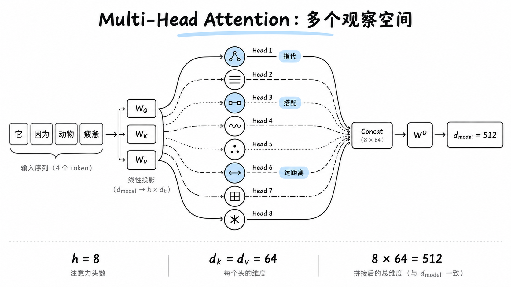

# 19. 一个头可能不够表达多种关系

<!-- node_id: 19; source_lines: 409-428; review_required: true -->

## 原稿摘录

一句话里同时存在很多关系：相邻搭配、主谓结构、代词指代、长距离依赖等。如果只在一个表示空间里计算一次注意力，多种关系可能互相挤压。

Multi-Head Attention 给每个头一套独立投影：

\[
\operatorname{head}_i=
\operatorname{Attention}(QW_i^Q,KW_i^K,VW_i^V)
\]

再把各头结果拼接并投影：

\[
\operatorname{MultiHead}(Q,K,V)
=\operatorname{Concat}(head_1,\dots,head_h)W^O
\]

## 教学草稿

待审核：仅使用原稿能够支持的材料，补充学习目标、“是什么、为什么、怎么用”、示例、反例和常见误区。
