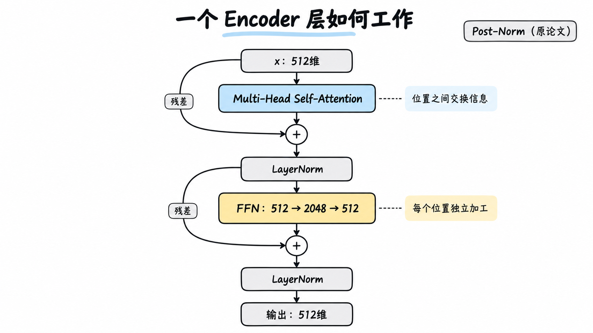

# 26. 一个 Encoder 层有两个核心子层

<!-- node_id: 26-encoder; source_lines: 515-525; review_required: true -->

## 原稿摘录

每层包含：

1. Multi-Head Self-Attention
2. Position-wise Feed-Forward Network

此外，每个子层外都有残差连接和 LayerNorm。

## 教学草稿

待审核：仅使用原稿能够支持的材料，补充学习目标、“是什么、为什么、怎么用”、示例、反例和常见误区。
