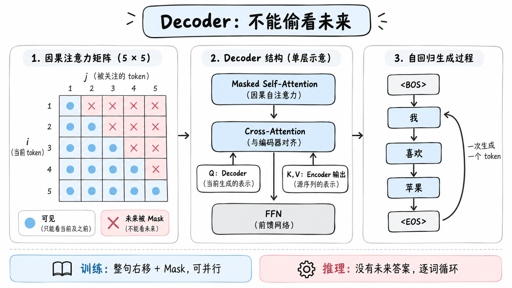

# 33. Cross-Attention 中 Q、K、V 来自哪里？

<!-- node_id: 33-cross-attention-q-k-v; source_lines: 623-634; review_required: true -->

## 原稿摘录

这是理解 Encoder–Decoder 的关键：

- Q：来自 Decoder 当前层；
- K：来自 Encoder 最终输出；
- V：来自 Encoder 最终输出。

Decoder 用当前生成需求去查询源句。这和搜索系统的直觉非常接近：Decoder 提出问题，Encoder 提供索引与内容。

## 教学草稿

待审核：仅使用原稿能够支持的材料，补充学习目标、“是什么、为什么、怎么用”、示例、反例和常见误区。
